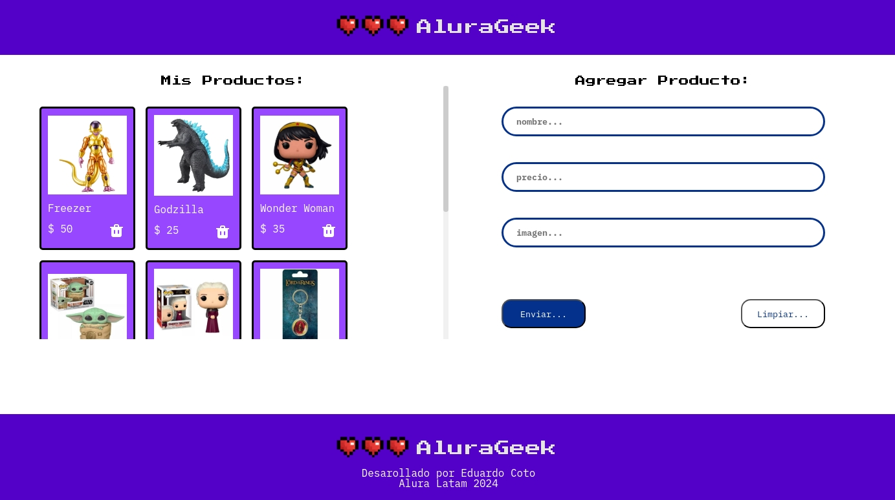

# AluraGeek

**AluraGeek** es una aplicación web que permite a los usuarios gestionar una lista de productos. Los usuarios pueden **visualizar**, **agregar** y **eliminar** productos, utilizando tecnologías frontend modernas y un servidor JSON simulado.

## 🔥 Características

- **Visualizar** productos existentes.
- **Agregar** nuevos productos proporcionando nombre, precio e imagen.
- **Eliminar** productos de la lista.
- Manejo dinámico del DOM para actualizar productos sin recargar la página.
- Conexión con un servidor simulado mediante **json-server** para realizar operaciones **CRUD**.

## 💻 Tecnologías Utilizadas

- **HTML5/CSS3**: Estructura y diseño.
- **JavaScript (ES6 Modules)**: Lógica e interacción.
- **json-server**: API RESTful simulada.
- **Fetch API**: Solicitudes HTTP.
- **BEM (Block Element Modifier)**: Metodología para nombrar clases CSS.

## 📋 Uso de la Aplicación

1. **Visualizar Productos**: Los productos se cargan automáticamente desde el servidor simulado al abrir la página.
   
2. **Agregar Producto**: Completa el formulario con nombre, precio y URL de la imagen, luego haz clic en **"Enviar"**.
   
3. **Eliminar Producto**: Haz clic en el ícono de la papelera para eliminar un producto.

---
Desarrollado por Eduardo Coto
